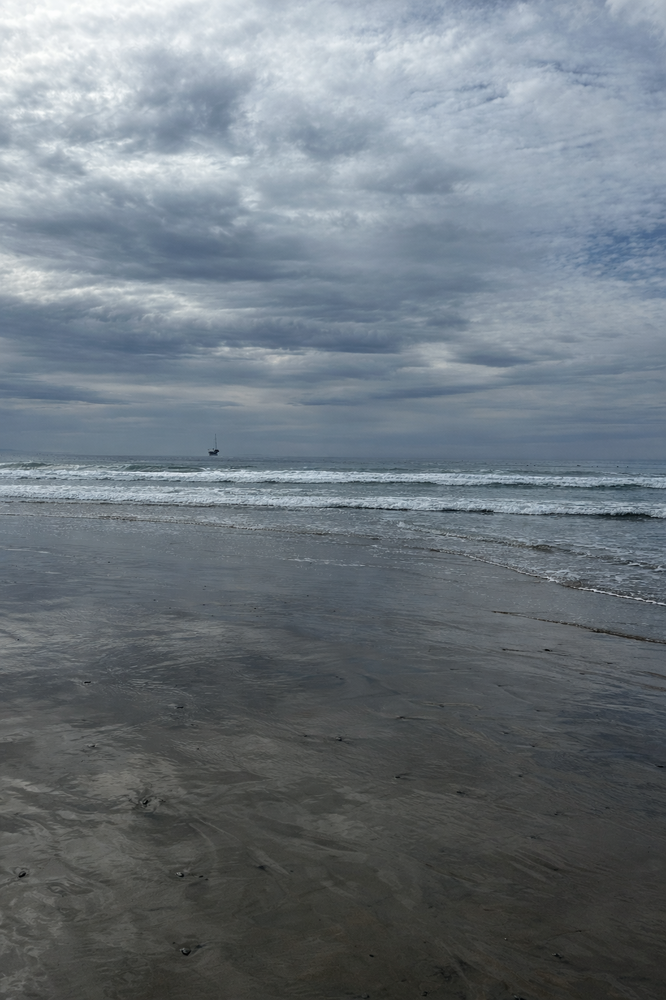
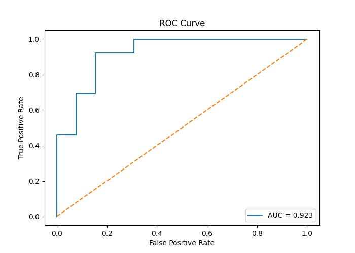
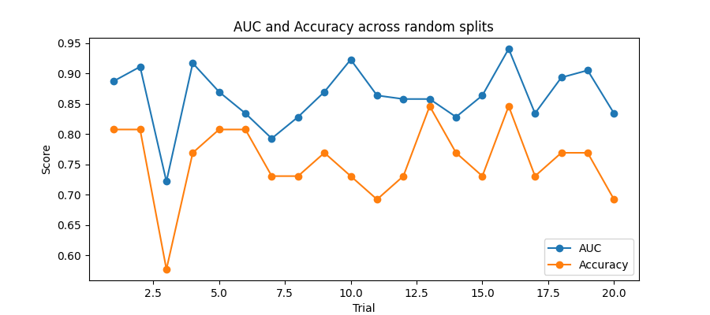

# Basic AI Image Detector

## Overview
It has become increasingly difficult to detect between real and AI generated images. This is a basic AI image detector attempting to distinguish between real and ChatGPT generated images. This model uses a convolutional neural network (CNN) to extract an image embedding code which is then used to train a logistic regression model. The goal was to train a model on the feature differences between a real image and an AI created copy image. When performing the logistic regression on 20 itterations, it was able to perform with a ~75-80% chance of correctly predicting an AI generated image, and an average AUC around ~0.86 (varies by random split).

## Introduction and Backgroun
This is a basic AI image detector which is trained to detect AI images created by ChatGPT. The dataset began by consisting of 62 scenic ocean images. Each image was added to ChatGPT with the prompt "Recreate this image". This resulted in a dataset of 124 images, 62 real images and 62 'copy' AI generated ones.

## Data Collection
To ensure the images used in the "real image" category where actually authentic and not AI generated, I used photos I had on my phone that I knew with 100% certanty where not AI generated. I selected to use scenic ocean photos because I had a good amount of these. In order to get an AI version of each image, i added it to a ChatGPT conversation with the prompt "Recreate this image". I then downloaded the image and saved it in a folder with other images generated in the same manner. Each 'real' and AI photo also had the same name, the only way to distinguish between the two was what folder they are located in.

### Image of real and AI side-by-side

  
  

### The image on the left is an AI generated copy of the image on the right

## Train and Test Split
The file `img_split.py` uses a random seed to randomly select a predefined number of files from the real-image folder. These selected filenames become the training set, and the remaining filenames become the test set.

**Important note:** I only split based on the *real* folder, because the AI folder contains the matching “recreated” version of each real image with the exact same filename. So once I have a list of names for train/test, I can grab both:
- `real/<name>` (label = 0)
- `ai/<name>` (label = 1)

In the final version of `img_split.py`, the function looks like this:
- `img_splt(path, train_size=49, seed=None)` and it will return `(random_names_train, random_names_test)`.

This made it easy to repeat experiments across multiple random splits by changing the seed.

## Dataset (Repo Sample)
This repository includes a small sample dataset for demonstration:
- `sample_real/` (4 real photos)
- `sample_ai/` (4 AI-recreated copies)

The full dataset used in experiments containg the 62 real and 62 AI images is not included in the repo due to file size limits. 

## Feature Extraction (Embeddings)
Images are too large to feed directly into a simple model like logistic regression. So the next step is to convert each image into a **fixed-length feature vector** (“embedding”) using a CNN.

### What is CNN embedding
A CNN trained on natural images learns useful visual features (edges, textures, shapes, patterns). Instead of manually designing features, we let the pretrained model create a numeric representation of each image.

### ResNet50 Embeddings
The file `resnet_embedding.py` loads a pretrained **ResNet50** model and removes the final classifier layer so the output becomes a **2048-dimensional feature vector** for each image.

For every filename in the train/test lists, `build_xy(name_list)` does:
1. Load the REAL image from `data/real/<name>`
2. Load the AI image from `data/ai/<name>`
3. Run both through ResNet50 (in evaluation mode)
4. (Optional) normalize the vectors
5. Append to:
   - `X` = the embedding vectors
   - `y` = labels (0 = real, 1 = ai)

This produces:
- `X_train, y_train`
- `X_test, y_test`

## Logistic Regression Model
Once each image is represented by an embedding vector, I train a logistic regression classifier.

### What the model is doing
Each image has an embedding vector:

- For ResNet: `x_i ∈ R^2048`

The logistic regression model estimates:

- `P(y_i = 1 | x_i) = 1 / (1 + exp(-(β0 + β^T x_i)))`

Where:
- `y_i = 1` means “AI”
- `y_i = 0` means “real”
- `β` is a vector of learned weights (one weight per embedding dimension)
- `β0` is the intercept

The model learns `β0` and `β` from `(X_train, y_train)`, then uses the same learned parameters to predict probabilities on `X_test`.

## Evaluation Metrics
I evaluated the model using multiple metrics:

### Accuracy
`model.score(X_test, y_test)` gives the fraction of correct predictions at the default threshold (usually 0.5).

### Confusion Matrix
A confusion matrix shows how many examples were:
- True real (real predicted real)
- False AI (real predicted AI)
- False real (AI predicted real)
- True AI (AI predicted AI)

This helps identify whether the model is making more mistakes on one class than the other.

### ROC Curve + AUC
Instead of using one fixed threshold (like 0.5), the ROC curve evaluates the classifier across *all* thresholds.

- ROC plots True Positive Rate (TPR) vs False Positive Rate (FPR)
- AUC measures the overall separability between the two classes
  - AUC = 0.5 → random guessing
  - AUC = 1.0 → perfect separation

## Repeated Trials (Random Splits)
Because the dataset is relatively small, the exact train/test split can change results a lot. To get a more stable estimate, I repeated the full experiment across multiple random seeds:

For each trial:
1. Create a new random train/test split
2. Build `X_train, y_train, X_test, y_test`
3. Train logistic regression
4. Compute AUC (and optionally accuracy)

Then I summarized the distribution of AUC scores:
- Mean AUC
- Standard deviation of AUC
- (Optional) a 95% confidence interval approximation
- Histogram and boxplot of AUC across splits

## Results

### Single train/test split (example)
Below is an example run using one random train/test split.

- **Confusion matrix + classification report:** (see screenshot below)
- **ROC curve:** (see plot below)

  

> Brief interpretation: the confusion matrix summarizes how many real vs AI images were correctly/incorrectly classified, and the ROC curve/AUC summarizes ranking quality across all thresholds.

### Results across 20 random splits
To see how sensitive performance is to the random split (since the dataset is small), I repeated the full pipeline 20 times with different seeds.

- **Mean AUC ± SD:** 0.8618 ± 0.0503  
- **Mean Accuracy ± SD:** 0.7558 ± 0.0615  
- **95% CI for mean AUC (normal approx):** [0.8398, 0.8839]

Plot below show AUC/accuracy by trial and the distribution of AUC values across splits.

  

## How to Run
A typical workflow is:

1. Place images into the expected folders:
   - `data/real/`
   - `data/ai/`

2. Generate a train/test split:
   - Use `img_split.py` to get `train_names` and `test_names`

3. Extract embeddings:
   - Run `resnet_embedding.py` to build `X_train, y_train, X_test, y_test`

4. Train logistic regression + evaluate:
   - Run your notebook / script that fits the model and prints:
     - accuracy
     - confusion matrix
     - ROC + AUC
     - repeated trials summary

## Limitations
- Small dataset (only 62 real + 62 AI)
- All AI images come from one specific method/model (“ChatGPT recreate this image”)
- This is focused on one photo domain (scenic ocean images), so it may not generalize to other image types
- A detector trained on embeddings may learn differences caused by the generation pipeline (compression, resizing, color shifts), not only “AI texture patterns”

## Future Work / Next Steps
- Collect more real photos and AI recreations to improve stability
- Expand beyond scenic ocean images to test generalization
- Compare CLIP embeddings vs ResNet embeddings
- Try other feature extraction models
- Try fine-tuning an end-to-end CNN model once a larger dataset is available

## Credits / Tools Used
- Python, NumPy, scikit-learn
- PyTorch + torchvision (ResNet50)
- PIL for image loading
- ChatGPT used to generate AI “recreated” images from real photos
